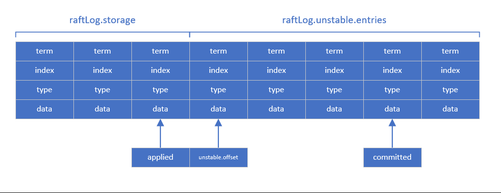
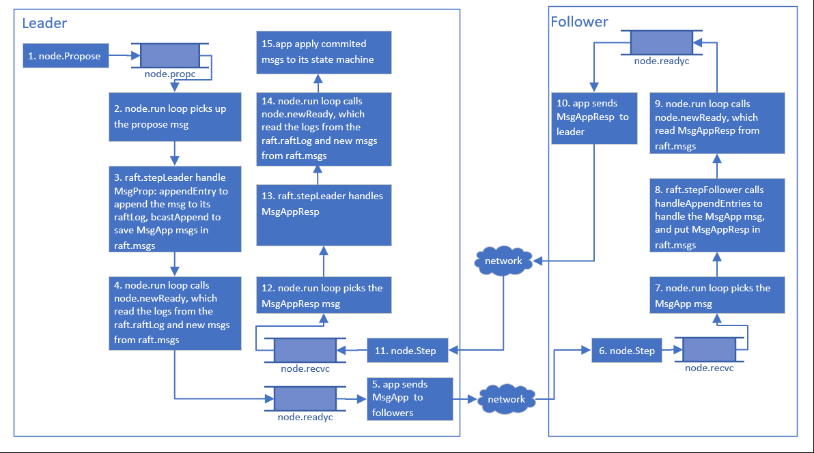
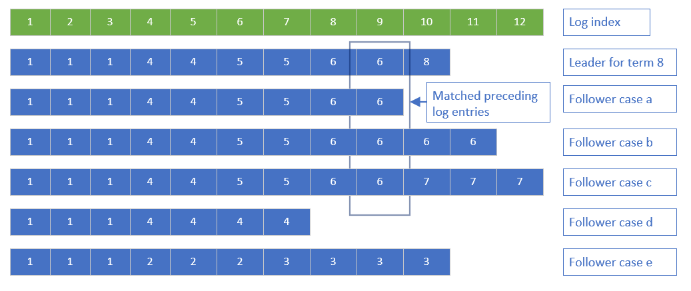
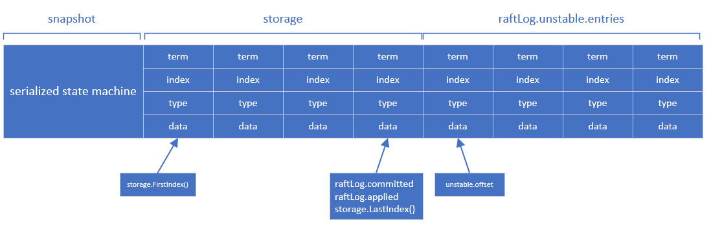
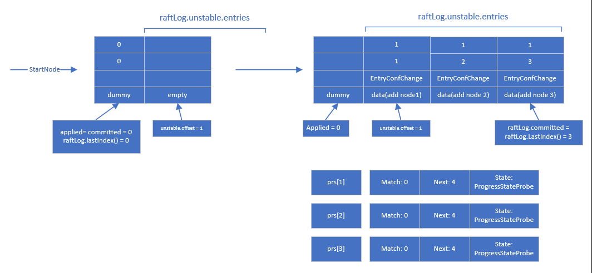
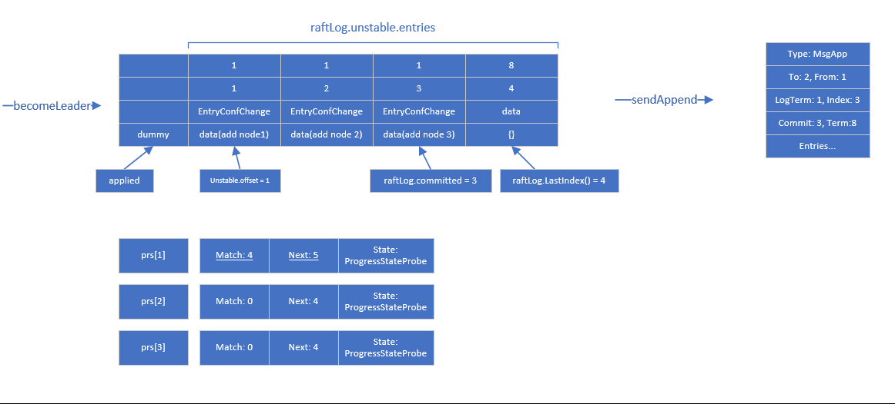
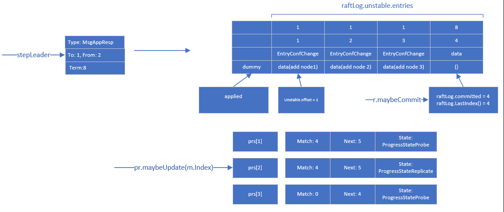
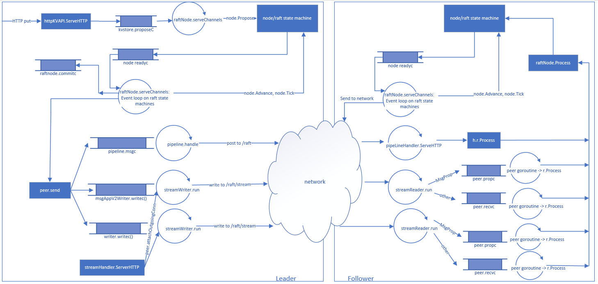
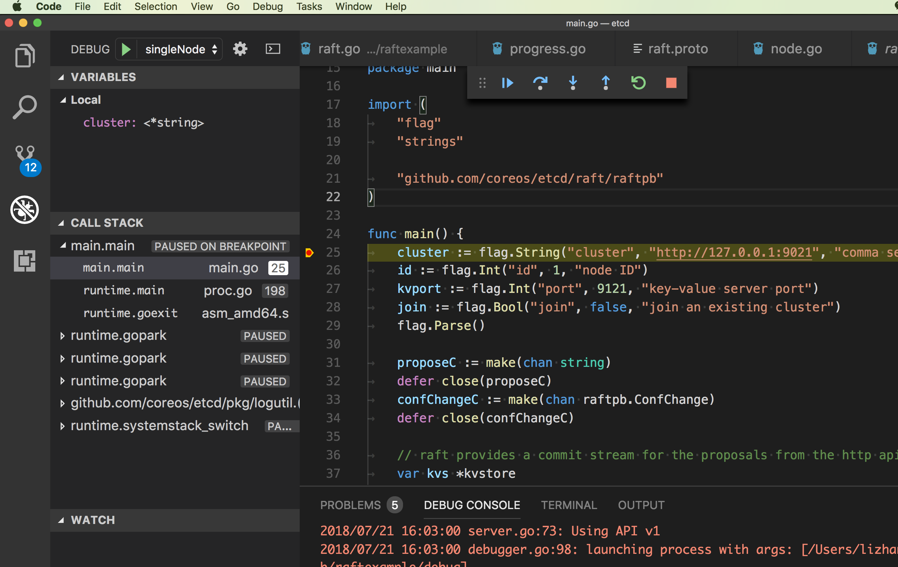

This doc tries to use the etcd raft (https://github.com/coreos/etcd/tree/master/raft) example application (raftexample at contrib/raftexample) to explain how the etcd raft algorithm works. Comparing with Paxos, raft tries to build a distributed consensus algorithm that is easier to understand. If you have not done so before, it is suggested to read the original raft paper "In Search of an Understandable Consensus Algorithm"
(https://ramcloud.stanford.edu/raft.pdf) and the raft Ph.D. dissertation (https://ramcloud.stanford.edu/~ongaro/thesis.pdf) to get yourself familiar with the raft algorithm. In addition to these articles, I found this video (https://www.youtube.com/watch?v=YbZ3zDzDnrw) is one of the best that explains how raft works.

## Contents

1\. [Log replication](#log-replication)

2\. [Snapshot](#snapshot)

3\. [Leader election](#leader-election)

4\. [Startup](#startup)

5\. [Cluster membership change](#cluster-membership-change)

6\. [Node communications](#node-communications)

7\. [Debug etcd raft using Visual Studio Code](#debug-etcd-raft-using-visual-studio-code)

## Log replication

Raft manages a replicated log, it first elects a leader, then gives the leader complete responsibility for managing the replicated log. The leader accepts log entries from clients, replicates them to other servers, and tells other servers when it is safe to apply log entries to their state machines.

In its simplest form (without considering snapshot, I will cover snapshot in more details in the snapshot section later), the log in etcd raft looks like below, the leader replicates its log entries to followers to tries to keep the followers log in sync with it:



The raftLog struct manages the log:

```go
type raftLog struct {
	// storage contains all stable entries since the last snapshot.
	storage Storage

	// unstable contains all unstable entries and snapshot.
	// they will be saved into storage.
	unstable unstable

	// committed is the highest log position that is known to be in
	// stable storage on a quorum of nodes.
	committed uint64
	// applied is the highest log position that the application has
	// been instructed to apply to its state machine.
	// Invariant: applied <= committed
	applied uint64

	logger Logger
}
```

The raftLog.committed member is the highest log position that has been accepted by a quorum of the nodes; and the raftLog.applied member is the highest log position that the raft server application has applied to its state machine.

The key raft logic is implemented in struct raft (raft/raft.go) and struct node (raft/node.go). Struct raft maintains its own state machine, struct node receives messages (raftpb.Message) from the application or other node, drives the raft state machine to move forward using the messages, and sends out the raft state machine output for the application to execute. Each raft state (follower, candidate, leader) implements its own 'step' method ('stepFollower', 'stepCandidate', 'stepLeader'). Each step is determined by its raftpb.MessageType. Note that every step is checked by one common method 'Step' that safety-checks the terms of node and incoming message to prevent stale log entries. The file raft/doc.go has documented the main message types, I copy them here for easier reference. And godoc has more details (https://godoc.org/github.com/coreos/etcd/raft) regarding the etcd raft implementation.


> 'MsgHup' is used for election. If a node is a follower or candidate, the
'tick' function in 'raft' struct is set as 'tickElection'. If a follower or
candidate has not received any heartbeat before the election timeout, it
passes 'MsgHup' to its Step method and becomes (or remains) a candidate to
start a new election.

> 'MsgBeat' is an internal type that signals the leader to send a heartbeat of
the 'MsgHeartbeat' type. If a node is a leader, the 'tick' function in
the 'raft' struct is set as 'tickHeartbeat', and triggers the leader to
send periodic 'MsgHeartbeat' messages to its followers.

> 'MsgProp' proposes to append data to its log entries. This is a special
type to redirect proposals to leader. Therefore, send method overwrites
raftpb.Message's term with its HardState's term to avoid attaching its
local term to 'MsgProp'. When 'MsgProp' is passed to the leader's 'Step'
method, the leader first calls the 'appendEntry' method to append entries
to its log, and then calls 'bcastAppend' method to send those entries to
its peers. When passed to candidate, 'MsgProp' is dropped. When passed to
follower, 'MsgProp' is stored in follower's mailbox(msgs) by the send
method. It is stored with sender's ID and later forwarded to leader by
rafthttp package.

> 'MsgApp' contains log entries to replicate. A leader calls bcastAppend,
which calls sendAppend, which sends soon-to-be-replicated logs in 'MsgApp'
type. When 'MsgApp' is passed to candidate's Step method, candidate reverts
back to follower, because it indicates that there is a valid leader sending
'MsgApp' messages. Candidate and follower respond to this message in
'MsgAppResp' type.

> 'MsgAppResp' is response to log replication request('MsgApp'). When
'MsgApp' is passed to candidate or follower's Step method, it responds by
calling 'handleAppendEntries' method, which sends 'MsgAppResp' to raft
mailbox.

> 'MsgVote' requests votes for election. When a node is a follower or
candidate and 'MsgHup' is passed to its Step method, then the node calls
'campaign' method to campaign itself to become a leader. Once 'campaign'
method is called, the node becomes candidate and sends 'MsgVote' to peers
in cluster to request votes. When passed to leader or candidate's Step
method and the message's Term is lower than leader's or candidate's,
'MsgVote' will be rejected ('MsgVoteResp' is returned with Reject true).
If leader or candidate receives 'MsgVote' with higher term, it will revert
back to follower. When 'MsgVote' is passed to follower, it votes for the
sender only when sender's last term is greater than MsgVote's term or
sender's last term is equal to MsgVote's term but sender's last committed
index is greater than or equal to follower's.

> 'MsgVoteResp' contains responses from voting request. When 'MsgVoteResp' is
passed to candidate, the candidate calculates how many votes it has won. If
it's more than majority (quorum), it becomes leader and calls 'bcastAppend'.
If candidate receives majority of votes of denials, it reverts back to
follower.

> 'MsgPreVote' and 'MsgPreVoteResp' are used in an optional two-phase election
protocol. When Config.PreVote is true, a pre-election is carried out first
(using the same rules as a regular election), and no node increases its term
number unless the pre-election indicates that the campaigining node would win.
This minimizes disruption when a partitioned node rejoins the cluster.

> 'MsgSnap' requests to install a snapshot message. When a node has just
become a leader or the leader receives 'MsgProp' message, it calls
'bcastAppend' method, which then calls 'sendAppend' method to each
follower. In 'sendAppend', if a leader fails to get term or entries,
the leader requests snapshot by sending 'MsgSnap' type message.

> 'MsgSnapStatus' tells the result of snapshot install message. When a
follower rejected 'MsgSnap', it indicates the snapshot request with
'MsgSnap' had failed from network issues which causes the network layer
to fail to send out snapshots to its followers. Then leader considers
follower's progress as probe. When 'MsgSnap' were not rejected, it
indicates that the snapshot succeeded and the leader sets follower's
progress to probe and resumes its log replication.

> 'MsgHeartbeat' sends heartbeat from leader. When 'MsgHeartbeat' is passed
to candidate and message's term is higher than candidate's, the candidate
reverts back to follower and updates its committed index from the one in
this heartbeat. And it sends the message to its mailbox. When
'MsgHeartbeat' is passed to follower's Step method and message's term is
higher than follower's, the follower updates its leaderID with the ID
from the message.

> 'MsgHeartbeatResp' is a response to 'MsgHeartbeat'. When 'MsgHeartbeatResp'
is passed to leader's Step method, the leader knows which follower
responded. And only when the leader's last committed index is greater than
follower's Match index, the leader runs 'sendAppend` method.

> 'MsgUnreachable' tells that request(message) wasn't delivered. When
'MsgUnreachable' is passed to leader's Step method, the leader discovers
that the follower that sent this 'MsgUnreachable' is not reachable, often
indicating 'MsgApp' is lost. When follower's progress state is replicate,
the leader sets it back to probe.

The node struct uses different channels to receive messages and send outputs.

```go
// node is the canonical implementation of the Node interface
type node struct {
	propc      chan msgWithResult
	recvc      chan pb.Message
	confc      chan pb.ConfChange
	confstatec chan pb.ConfState
	readyc     chan Ready
	advancec   chan struct{}
	tickc      chan struct{}
	done       chan struct{}
	stop       chan struct{}
	status     chan chan Status

	logger Logger
}
```

- propc for the leader to receive propose messages from the application.
- recvc for the followers to receive other kind of messsages from the leader, or for the leader to receives responses from the followers.
- confc to receive cluster configuration changes.
- confstatec to send out current cluster configurations.
- readyc for sending out the raft state machine output for the application to execute.
- tickc receives tick message. The application is responsible for calling node.Tick periodically, node.Tick send an empty struct (struct{}{}) to tickc. On receiving a message from tickc, leader runs tickHeartbeat to send a MsgHeartbeat after raft.heartbeatTimeout; followers and candidates runs tickElection, they will try to elect a new leader after raft.electionTimeout (see more details in the leader election section later).

Struct node and raft only implement the core Raft algorithm, both network and disk IO are left to the user application. The application must implement their own transportation layer for message passing between raft peers over the wire. Similarly, the application must implement their own storage layer to persist the raft log and state.

Struct node and raft manipulate only the unstable part of the log (raftLog.unstable as shown in the previous figure): when receiving new messages from the application, raft appends new log entries to unstable, and increases the committed counter when the message is accepted by a quorum of the nodes; after the application applies the committed log entries to the application state machine, node will ask raft to increase its applied counter.

Struct Ready encapsulates the raft state machine output, the application needs to read from the node.readyc channel (via node.Ready() function, which returns the readyc channel), persist pb.HardState and Entries (or Snapshot) to external storage, apply CommittedEntries to the application's state machine, and send Messages to peer nodes.

```go
// Ready encapsulates the entries and messages that are ready to read,
// be saved to stable storage, committed or sent to other peers.
// All fields in Ready are read-only.
type Ready struct {
	// The current volatile state of a Node.
	// SoftState will be nil if there is no update.
	// It is not required to consume or store SoftState.
	*SoftState

	// The current state of a Node to be saved to stable storage BEFORE
	// Messages are sent.
	// HardState will be equal to empty state if there is no update.
	pb.HardState

	// ReadStates can be used for node to serve linearizable read requests locally
	// when its applied index is greater than the index in ReadState.
	// Note that the readState will be returned when raft receives msgReadIndex.
	// The returned is only valid for the request that requested to read.
	ReadStates []ReadState

	// Entries specifies entries to be saved to stable storage BEFORE
	// Messages are sent.
	Entries []pb.Entry

	// Snapshot specifies the snapshot to be saved to stable storage.
	Snapshot pb.Snapshot

	// CommittedEntries specifies entries to be committed to a
	// store/state-machine. These have previously been committed to stable
	// store.
	CommittedEntries []pb.Entry

	// Messages specifies outbound messages to be sent AFTER Entries are
	// committed to stable storage.
	// If it contains a MsgSnap message, the application MUST report back to raft
	// when the snapshot has been received or has failed by calling ReportSnapshot.
	Messages []pb.Message

	// MustSync indicates whether the HardState and Entries must be synchronously
	// written to disk or if an asynchronous write is permissible.
	MustSync bool
}
```

Suppose the client proposes a value to the raft server application's leader node, the application will pass a MsgProp message to struct node and raft to handle it, let's see how they process this message.



1\. The application calls node.Propose, which will post a MsgProp message to channel node.propc.

```go
func (n *node) Propose(ctx context.Context, data []byte) error {
	return n.stepWait(ctx, pb.Message{Type: pb.MsgProp, Entries: []pb.Entry{{Data: data}}})
}
```

2\. The node.run loop picks the propose msg from the propc channel.

```go
case pm := <-propc:
	m := pm.m
	m.From = r.id
	err := r.Step(m)
	if pm.result != nil {
		pm.result <- err
		close(pm.result)
	}
```

3\. Function raft.stepLeader handles the MsgProp msg, it will append the propose message's Entries member into its raftLog, and send an append msg (msg type MsgApp) to all the peers. Function bcastAppend eventally calls to function raft.send (raft.send is a confusing name, which just appends the messages to its msgs member, it does not send the msg to network, instead, the raft server application is responsible for send the messages through the network to the peers).

```go
case pb.MsgProp:
	......
	r.appendEntry(m.Entries...)
	r.bcastAppend()
	return nil
	......
```

The leader uses the Progess struct to maintain the progress info for all the followers and sends log entries to the followers based on their corresponding progress info. There is a design doc regarding how Progress work at https://github.com/coreos/etcd/blob/master/raft/design.md. A progress struct has two important members: Match and Next. Match is the log entry index of the highest known matched entry for a follower. If the leader knows nothing about a follower’s replication status, Match is set to zero. Next is the index of the log entry that will be replicated to a follower. The Leader sends entries from Next to its latest one to the follower.

Function raft.sendAppend (which is called by raft.bcastAppend) determines which log entries to send to a follower based on its Progress info. As mentioned by the raft paper:

> When sending an AppendEntries RPC, the leader includes the index and term of the entry in its log that immediately precedes the new entries. If the follower does not find an entry in its log with the same index and term, then it refuses the new entries.

For MsgApp msg, the Message.Index member is for the preceding log entry's index, and the Message.LogTerm member is for the preceding log entry's term.

If a slow follower lags behind too much, the leader's log entries may be truncated (more in snapshot section later) so it cannot read the preceding log entry's term, or it cannot read any unstable entries, the leader will send MsgSnap instead of MsgApp to the follower:

```go
// sendAppend sends RPC, with entries to the given peer.
func (r *raft) sendAppend(to uint64) {
	......
	term, errt := r.raftLog.term(pr.Next - 1)
	ents, erre := r.raftLog.entries(pr.Next, r.maxMsgSize)

	if errt != nil || erre != nil { // send snapshot if we failed to get term or entries
	......
	} else {
		m.Type = pb.MsgApp
		m.Index = pr.Next - 1  // preceding log entry index
		m.LogTerm = term       // preceding log term
		m.Entries = ents
		m.Commit = r.raftLog.committed
	......
```

4\. In the for loop of the node.run function, it calls newReady function, this function reads raftLog and raft.msgs member to populate a Ready structure, and posts the Ready structure to the readyc channel:

```go
// function raft.newReady
func newReady(r *raft, prevSoftSt *SoftState, prevHardSt pb.HardState) Ready {
	rd := Ready{
		Entries:          r.raftLog.unstableEntries(),
		CommittedEntries: r.raftLog.nextEnts(),
		Messages:         r.msgs,
	}
......

// function node.run, post the Ready structure to the readyc channel:
case readyc <- rd:
	if rd.SoftState != nil {
		prevSoftSt = rd.SoftState
	}
	if len(rd.Entries) > 0 {
		prevLastUnstablei = rd.Entries[len(rd.Entries)-1].Index
		prevLastUnstablet = rd.Entries[len(rd.Entries)-1].Term
		havePrevLastUnstablei = true
	}
	if !IsEmptyHardState(rd.HardState) {
		prevHardSt = rd.HardState
	}
	if !IsEmptySnap(rd.Snapshot) {
		prevSnapi = rd.Snapshot.Metadata.Index
	}
	r.msgs = nil
	r.readStates = nil
	advancec = n.advancec
```

5\. The raft server application sends the MsgApp message to the followers. In the sample application, the code is in function raftNode.serveChannels (file contrib/raftexample/raft.go), and I will cover more details about how network communication is implemented in later section.

```go
// event loop on raft state machine updates
for {
	select {
	case <-ticker.C:
		rc.node.Tick()
	// store raft entries to wal, then publish over commit channel
	case rd := <-rc.node.Ready():
		rc.wal.Save(rd.HardState, rd.Entries)
		if !raft.IsEmptySnap(rd.Snapshot) {
			rc.saveSnap(rd.Snapshot)
			rc.raftStorage.ApplySnapshot(rd.Snapshot)
			rc.publishSnapshot(rd.Snapshot)
		}
		rc.raftStorage.Append(rd.Entries)
		// send msg to peers
		rc.transport.Send(rd.Messages)
		if ok := rc.publishEntries(rc.entriesToApply(rd.CommittedEntries)); !ok {
			rc.stop()
			return
		}
		rc.maybeTriggerSnapshot()
		rc.node.Advance()
	case err := <-rc.transport.ErrorC:
		rc.writeError(err)
		return
	case <-rc.stopc:
		rc.stop()
		return
	}
}
```

From the code, we can see that the server application does a lot of work:
- Save rd.HardState and rd.Entries to write ahead log (wal).
- Handle snapshot if rd.Snapshot is not empty.
- Append rd.Entries to storage.
- Send rd.Messages to peer.
- Apply commit log entries to the application state machine (via rc.publishEntries(rc.entriesToApply(rd.CommittedEntries))).
- Call node.Advance to step forward the raft state machine.

Essentially, it just performs the required actions for the raft applicaiton as mentioned in the raft doc https://github.com/coreos/etcd/blob/master/raft/README.md:

1. Write Entries, HardState and Snapshot to persistent storage in order, i.e. Entries first, then HardState and Snapshot if they are not empty. If persistent storage supports atomic writes then all of them can be written together. Note that when writing an Entry with Index i, any previously-persisted entries with Index >= i must be discarded.

2. Send all Messages to the nodes named in the To field. It is important that no messages be sent until the latest HardState has been persisted to disk, and all Entries written by any previous Ready batch (Messages may be sent while entries from the same batch are being persisted). To reduce the I/O latency, an optimization can be applied to make leader write to disk in parallel with its followers (as explained at section 10.2.1 in Raft thesis). If any Message has type MsgSnap, call Node.ReportSnapshot() after it has been sent (these messages may be large). Note: Marshalling messages is not thread-safe; it is important to make sure that no new entries are persisted while marshalling. The easiest way to achieve this is to serialise the messages directly inside the main raft loop.

3. Apply Snapshot (if any) and CommittedEntries to the state machine. If any committed Entry has Type EntryConfChange, call Node.ApplyConfChange() to apply it to the node. The configuration change may be cancelled at this point by setting the NodeID field to zero before calling ApplyConfChange (but ApplyConfChange must be called one way or the other, and the decision to cancel must be based solely on the state machine and not external information such as the observed health of the node).

4. Call Node.Advance() to signal readiness for the next batch of updates. This may be done at any time after step 1, although all updates must be processed in the order they were returned by Ready.

6\. On the follower node, upon receiving the MsgApp message, it calls node.Step to try to move the raft state machine forward, node.Step gets called in raftNode.Process (in file contrib/raftexample/raft.go), node.Step post the message to channel node.recvc.

```go
func (rc *raftNode) Process(ctx context.Context, m raftpb.Message) error {
	return rc.node.Step(ctx, m)
}
```

7\. The node.run loop on the follower node picks the MsgApp msg, and calls r.Step to handle the message:

```go
case m := <-n.recvc:
	// filter out response message from unknown From.
	if pr := r.getProgress(m.From); pr != nil || !IsResponseMsg(m.Type) {
		r.Step(m)
	}
```

8\. The function raft.stepFollower gets called to handle the MsgApp msg, which in turn calls handleAppendEntries:

```go
func (r *raft) handleAppendEntries(m pb.Message) {
	if m.Index < r.raftLog.committed {
		r.send(pb.Message{To: m.From, Type: pb.MsgAppResp, Index: r.raftLog.committed})
		return
	}

	if mlastIndex, ok := r.raftLog.maybeAppend(m.Index, m.LogTerm, m.Commit, m.Entries...); ok {
		r.send(pb.Message{To: m.From, Type: pb.MsgAppResp, Index: mlastIndex})
	} else {
		r.logger.Debugf("%x [logterm: %d, index: %d] rejected msgApp [logterm: %d, index: %d] from %x",
			r.id, r.raftLog.zeroTermOnErrCompacted(r.raftLog.term(m.Index)), m.Index, m.LogTerm, m.Index, m.From)
		r.send(pb.Message{To: m.From, Type: pb.MsgAppResp, Index: m.Index, Reject: true, RejectHint: r.raftLog.lastIndex()})
	}
}
```

In function handleAppendEntries, it handles the MsgApp msg differently based on the follower's log state:

- If the preceding log index (remember m.Index is the index of the log entry that preceding the new entries) is smaller than raftLog.committed, it just sends back a MsgAppResp msg, the response msg's Index is set to the follower's raftLog.committed.

- In raftLog.maybeAppend, if the preceding log entries match, the follower will truncate the conflicting log entries (if there are any), and append the new entries to its log, then it will send the MsgAppResp msg to the leader, the Index member of the response msg is set to the follower's last log index.

- If the preceding log entries does not match, the follower sends a rejected MsgAppResp to the leader, the Index member of the MsgAppResp msg is set to the incoming MsgApp msg's Index, and the RejectHint is set to the follower's raftLog.lastIndex().

In below diagram, when the leader at the top comes to power at term 8, it receives a propose msg and append the log to index 10, it tries to send the log entry at index 10 to followers. As mentioned before, when sending the log entry, it also includes the preceding log index and term (index 9 and term 6). For followers a, b and c, since their preceding log entries match with the leader, they will accept the MsgApp msg. For follower a, the new log entry gets append to its log directly; for follower b nd c, the conflicted log entries get truncated first, then the new log entry gets append. For follower d and e, since the preceding log entry does not match, so they will send a rejected MsgAppResp back to the leader.



9\. Similar to the leader, the follower populates a new Ready structure, posts it to its readyc channel. The Ready structure contains the MsgAppResp msg.

10\. The follower sends the MsgAppResp msg to the leader via the network.

11\. On the leader, node.Step gets called when receiving the MsgAppResp msg, and the msg gets put to the node.recvc channel.

12\. The leader's node.run loops picks up the MsgAppResp msg from the node.recvc channel.

13\. raft.stepLeader functions handles the MsgAppResp msg:

```go
case pb.MsgAppResp:
	pr.RecentActive = true
	if m.Reject {
		r.logger.Debugf("%x received msgApp rejection(lastindex: %d) from %x for index %d",
			r.id, m.RejectHint, m.From, m.Index)
		if pr.maybeDecrTo(m.Index, m.RejectHint) {
			r.logger.Debugf("%x decreased progress of %x to [%s]", r.id, m.From, pr)
			if pr.State == ProgressStateReplicate {
				pr.becomeProbe()
			}
			r.sendAppend(m.From)
		}
	} else {
		oldPaused := pr.IsPaused()
		if pr.maybeUpdate(m.Index) {
			switch {
			case pr.State == ProgressStateProbe:
				pr.becomeReplicate()
			case pr.State == ProgressStateSnapshot && pr.needSnapshotAbort():
				r.logger.Debugf("%x snapshot aborted, resumed sending replication messages to %x [%s]", r.id, m.From, pr)
				pr.becomeProbe()
			case pr.State == ProgressStateReplicate:
				pr.ins.freeTo(m.Index)
			}
			if r.maybeCommit() {
				r.bcastAppend()
			} else if oldPaused {
				// update() reset the wait state on this node. If we had delayed sending
				// an update before, send it now.
				r.sendAppend(m.From)
			}
			// Transfer leadership is in progress.
			if m.From == r.leadTransferee && pr.Match == r.raftLog.lastIndex() {
				r.logger.Infof("%x sent MsgTimeoutNow to %x after received MsgAppResp", r.id, m.From)
				r.sendTimeoutNow(m.From)
			}
		}
	}
```
- for rejected response, the leader calls Progress.maybeDecrTo, which decreases the Progress.Next for the rejecting follower, next time, the leader will send older log entries to the follower.
- for accepted response, the leader calls Progress.maybeUpdate, which increases the Progress.Next and Pregress.Match for the follower, next time, the leader will send newer log entries to the follower.

14\. Similar as before (see step 4), in the node.run loop, the leader create a new Ready structure and post it to the readyc channel.

15\. The leader application applies any committed log entries to its own state machine.

## Snapshot

Now let's see how snapshot works from end to end. Raft’s log grows during normal operation as it incorporates more client requests. As it grows larger, it occupies more space and takes more time to replay. Snapshot is an approach to compact the log. The raft example application uses snapshot to keep its raft log at manageable size.

1\. Leader node creates snapshot.

The raft example application creates snapshot and compacts the raft log in function raftNode.maybeTriggerSnapshot:

```go
func (rc *raftNode) maybeTriggerSnapshot() {
	if rc.appliedIndex-rc.snapshotIndex <= rc.snapCount {
		return
	}

	log.Printf("start snapshot [applied index: %d | last snapshot index: %d]", rc.appliedIndex, rc.snapshotIndex)
	// get a snapshot for the state machine
	data, err := rc.getSnapshot()
	if err != nil {
		log.Panic(err)
	}
	// calls to raftStorage to create the snapshot
	snap, err := rc.raftStorage.CreateSnapshot(rc.appliedIndex, &rc.confState, data)
	if err != nil {
		panic(err)
	}
	if err := rc.saveSnap(snap); err != nil {
		panic(err)
	}

	compactIndex := uint64(1)
	if rc.appliedIndex > snapshotCatchUpEntriesN {
		compactIndex = rc.appliedIndex - snapshotCatchUpEntriesN
	}
	// compact the log entries in raftStorage
	if err := rc.raftStorage.Compact(compactIndex); err != nil {
		panic(err)
	}

	log.Printf("compacted log at index %d", compactIndex)
	// advance the snapshotIndex counter
	rc.snapshotIndex = rc.appliedIndex
}
```

The raftNode struct maintains two counters: appliedIndex and snapshotIndex. Member appliedIndex is the latest log index that has been applied to the application's state machine, and member snapshotIndex is the latest log index that has been saved to the snapshot. So appliedIndex - snapshotIndex is the number of log entries that the application has received after the last snapshot but has not been saved to new snapshot yet. From the code, we can see that if appliedIndex - snapshotIndex > rc.snapCount (default value is 10000), it will create a snapshot. In another word, the application will create a snapshot for every 10000 log entries.

With snapshot, the entire state of the raft application looks like below:



2\. Leader node replicates snapshot to followers.

As mentioned before, if a slow follower lags behind two much, when the leader tries to send log entries to this slow follower, the leader's log entries have been truncated already after a snapshot operation, so it cannot read the preceding log entry's term or cannot read any log entries based on the follower's progress, in this case, the leader will send MsgSnap msg to the follower, this msg will replicate the snapshot to the follower.

```go
// in raft.sendAppend function
term, errt := r.raftLog.term(pr.Next - 1)
ents, erre := r.raftLog.entries(pr.Next, r.maxMsgSize)
if errt != nil || erre != nil { // send snapshot if we failed to get term or entries
```

3\. Follower handles the MsgSnap msg.

The follower handles teh MsgSnap msg in function raft.HandleSnapshot:

```go
func (r *raft) handleSnapshot(m pb.Message) {
	sindex, sterm := m.Snapshot.Metadata.Index, m.Snapshot.Metadata.Term
	if r.restore(m.Snapshot) {
		r.logger.Infof("%x [commit: %d] restored snapshot [index: %d, term: %d]",
			r.id, r.raftLog.committed, sindex, sterm)
		r.send(pb.Message{To: m.From, Type: pb.MsgAppResp, Index: r.raftLog.lastIndex()})
	} else {
		r.logger.Infof("%x [commit: %d] ignored snapshot [index: %d, term: %d]",
			r.id, r.raftLog.committed, sindex, sterm)
		r.send(pb.Message{To: m.From, Type: pb.MsgAppResp, Index: r.raftLog.committed})
	}
}
```

Function raft.restore eventually calls to unstable.restore, in unstable.restore, unstable.entries is set to nil, and unstable.snapshot is set to the snapshot passed from the leader. Note that the snapshot is not persisted yet, it is the application's responsibility to persist the snapshot to external storage.

```go
func (u *unstable) restore(s pb.Snapshot) {
	u.offset = s.Metadata.Index + 1
	u.entries = nil
	u.snapshot = &s
}
```

4\. Follower persists the snapshot to external storage and apply the snapshot to its own state machine.

In raftNode.serveChannels, if the Ready struct outputted by the raft state machine has snapshot, it will save the snapshot to wal and raftStorage, and apply the snapshot to the application's own state machine:

```go
// store raft entries to wal, then publish over commit channel
case rd := <-rc.node.Ready():
	......
	if !raft.IsEmptySnap(rd.Snapshot) {
		// save snapshot to wal
		rc.saveSnap(rd.Snapshot)
		// save snapshot info to raftStorage
		rc.raftStorage.ApplySnapshot(rd.Snapshot)
		// apply snapshot to the application's own state machine
		rc.publishSnapshot(rd.Snapshot)
	}
	......
```

This is the entire flow of how snapshot works, it is also driven by the leader: leader creates snapshot -> leader sends snapshot to follower -> follower persists and applies the snapshot.

## Leader election

When nodes start up, they begin as followers:

```go
func (r *raft) becomeFollower(term uint64, lead uint64) {
	r.step = stepFollower
	r.reset(term)
	r.tick = r.tickElection
	r.lead = lead
	r.state = StateFollower
	r.logger.Infof("%x became follower at term %d", r.id, r.Term)
}
```

A follower maintains below members for leader election:

- electionTimeout, which is passed in via Config.
- randomizedElectionTimeout, which is calculated based on electionTimeout.
- electionElapsed, the raft application is responsible for calling raft.tickElection periodically, each call of tickElection increases the electionElapsed counter. When this counter is bigger than randomizedElectionTimeout, it will start the campaign to try to become a leader.

```go
// number of ticks since it reached last electionTimeout when it is leader
// or candidate.
// number of ticks since it reached last electionTimeout or received a
// valid message from current leader when it is a follower.
electionElapsed int
......
electionTimeout  int
// randomizedElectionTimeout is a random number between
// [electiontimeout, 2 * electiontimeout - 1]. It gets reset
// when raft changes its state to follower or candidate.
randomizedElectionTimeout int
```

For the raft example application, it creates a Ticker object and utilizes the ticker to call raft.tickElection every 100 milliseconds:

```go
// in function raftNode.serveChannels:
ticker := time.NewTicker(100 * time.Millisecond)
defer ticker.Stop()
......
	// event loop on raft state machine updates
for {
	select {
	case <-ticker.C:
		// this calls to raft.tickElection for followers
		rc.node.Tick()
......
```

The etcd raft has implemented the PreVote optimization, this helps to prevents disruption when a node that has been partitioned away rejoins the cluster. This disruption and how PreVote helps to address this issue are discussed in section 9.6 of the raft Ph.D. dissertation:

> One downside of Raft’s leader election algorithm is that a server that has been partitioned from the cluster is likely to cause a disruption when it regains connectivity. When a server is partitioned, it will not receive heartbeats. It will soon increment its term to start an election, although it won’t be able to collect enough votes to become leader. When the server regains connectivity sometime later, its larger term number will propagate to the rest of the cluster (either through the server’s RequestVote requests or through its AppendEntries response). This will force the cluster leader to stepdown, and an new election will have to take place to select a new leader. Fortunately, such events are likely to be rare, and each will only cause one leader to step down. 

> If desired, Raft’s basic leader election algorithm can be extended with an additional phase to prevent such disruptions, forming the Pre-Vote algorithm. In the Pre-Vote algorithm, a candidate only increments its term if it first learns from a majority of the cluster that they would be willing to grant the candidate their votes (if the candidate’s log is sufficiently up-to-date, and the voters have not received heartbeats from a valid leader for at least a baseline election timeout). 

Now let's ignore the PreVote phase for a moment and see how the vote phase works.

1\. When election times out, a follower sends MsgVote to other nodes.

All a node starts, the ticker object keeps calling raft.tickElection, which increases the electionElapsed counter for each call. Once electionElapsed is bigger than randomizedElectionTimeout, it calls raft.Step with a MsgHup msg to move the raft state machine forward.

```go
// tickElection is run by followers and candidates after r.electionTimeout.
func (r *raft) tickElection() {
	r.electionElapsed++

	if r.promotable() && r.pastElectionTimeout() {
		r.electionElapsed = 0
		r.Step(pb.Message{From: r.id, Type: pb.MsgHup})
	}
}
```

In raft.Step, for the MsgHup msg, it will call raft.campaign. raft.campaign will call raft.becomeCandidate, becomeCandidate increases Term, then raft.campaign will send vote msg to other nodes. When can see when it sends the vote msg, it includes 
r.raftLog.lastIndex() and r.raftLog.lastTerm() in the msg. Other node will use this info to check if it is safe to vote for the sending node as the leader (see below). 

```go
r.send(pb.Message{Term: term, To: id, Type: voteMsg, Index: r.raftLog.lastIndex(), LogTerm: r.raftLog.lastTerm(), Context: ctx})
```

2\. Handle the MsgVote msg.

It handles MsgVote in raft.Step function:

```go
// ...and we believe the candidate is up to date.
if canVote && r.raftLog.isUpToDate(m.Index, m.LogTerm) {
	r.logger.Infof("%x [logterm: %d, index: %d, vote: %x] cast %s for %x [logterm: %d, index: %d] at term %d",
		r.id, r.raftLog.lastTerm(), r.raftLog.lastIndex(), r.Vote, m.Type, m.From, m.LogTerm, m.Index, r.Term)
	// When responding to Msg{Pre,}Vote messages we include the term
	// from the message, not the local term. To see why consider the
	// case where a single node was previously partitioned away and
	// it's local term is now of date. If we include the local term
	// (recall that for pre-votes we don't update the local term), the
	// (pre-)campaigning node on the other end will proceed to ignore
	// the message (it ignores all out of date messages).
	// The term in the original message and current local term are the
	// same in the case of regular votes, but different for pre-votes.
	r.send(pb.Message{To: m.From, Term: m.Term, Type: voteRespMsgType(m.Type)})
```
Here it uses raftLog.isUpToDate to check if the sending node's raft log is more up to date, it only grants vote to node which has more up to date logs:

```go
// isUpToDate determines if the given (lastIndex,term) log is more up-to-date
// by comparing the index and term of the last entries in the existing logs.
// If the logs have last entries with different terms, then the log with the
// later term is more up-to-date. If the logs end with the same term, then
// whichever log has the larger lastIndex is more up-to-date. If the logs are
// the same, the given log is up-to-date.
func (l *raftLog) isUpToDate(lasti, term uint64) bool {
	return term > l.lastTerm() || (term == l.lastTerm() && lasti >= l.lastIndex())
}
```

This is called the "Leader Completeness Property" in the raft paper:

> Raft uses the voting process to prevent a candidate from winning an election unless its log contains all committed entries. A candidate must contact a majority of the cluster in order to be elected, which means that every committed entry must be present in at least one of those servers. If the candidate’s log is at least as up-to-date as any other log in that majority (where “up-to-date” is defined precisely below), then it will hold all the committed entries. The RequestVote RPC implements this restriction: the RPC includes information about the candidate’s log, and the voter denies its vote if its own log is more up-to-date than that of the candidate. 

> Raft determines which of two logs is more up-to-date by comparing the index and term of the last entries in the logs. If the logs have last entries with different terms, then the log with the later term is more up-to-date. If the logs end with the same term, then whichever log is longer is more up-to-date.

3\. Candidate handles MsgVoteResp. The candidate handles MsgVoteResp in function stepCandidate, once it receives a quorum of accepted vote response, it will become the leader.

```go
case myVoteRespType:
	gr := r.poll(m.From, m.Type, !m.Reject)
	r.logger.Infof("%x [quorum:%d] has received %d %s votes and %d vote rejections", r.id, r.quorum(), gr, m.Type, len(r.votes)-gr)
	switch r.quorum() {
	case gr:
		if r.state == StatePreCandidate {
			r.campaign(campaignElection)
		} else {
			r.becomeLeader()
			r.bcastAppend()
		}
	case len(r.votes) - gr:
		// pb.MsgPreVoteResp contains future term of pre-candidate
		// m.Term > r.Term; reuse r.Term
		r.becomeFollower(r.Term, None)
	}
```

4\. Leader periodically sends out MsgHeartbeat to followers.

The leader maintains heartbeatElapsed counter and heartbeatTimeout (which is passed in via Config, like the electionTimeout member). 

```go
// number of ticks since it reached last heartbeatTimeout.
// only leader keeps heartbeatElapsed.
heartbeatElapsed int
......
heartbeatTimeout int
```

The raft example application uses the same ticker object to call raft.tickHeartbeat, this function increases the heartbeatElapsed counter, once this counter is bigger than heartbeatTimeout, it will send MsgHeartBeat to followers to maintain its leader state. 

```go
// tickHeartbeat is run by leaders to send a MsgBeat after r.heartbeatTimeout.
func (r *raft) tickHeartbeat() {
	r.heartbeatElapsed++
	......
	if r.heartbeatElapsed >= r.heartbeatTimeout {
		r.heartbeatElapsed = 0
		// MsgBeat will cause leader to send MsgHeartbeat to followers
		r.Step(pb.Message{From: r.id, Type: pb.MsgBeat})
	}
}
```

The leader's heartbeatTimeout should be smaller than the follower's electionTimeout, in the raft example application, their values are from Config.HeartbeatTick and Config.ElectionTick respectively. Since ticker fires every 100 milliseconds, it means that the leader sends heart msgs to the follower every 100 milliseconds, and if a follower does not hear from a leader in more than 1 seconds, it may start a new election (to be accurate, iff electionElapsed is greater than or equal to the randomized election timeout in [electiontimeout, 2 * electiontimeout - 1], see function raft.resetRandomizedElectionTimeout and raft.pastElectionTimeout for details):

```go
c := &raft.Config{
	ID:              uint64(rc.id),
	ElectionTick:    10,
	HeartbeatTick:   1,
	Storage:         rc.raftStorage,
	MaxSizePerMsg:   1024 * 1024,
	MaxInflightMsgs: 256,
}
```

5\. Handle MsgHeartbeat.
Once a node in a follower state receives a MsgHeatbeat msg, it set is electionElapsed to 0, set its lead as the sending node:

```go
// in function stepFollower
case pb.MsgHeartbeat:
	r.electionElapsed = 0
	r.lead = m.From
	r.handleHeartbeat(m)
```

Once a node in a candidate state receives a MsgHeatbeat msg, it becomes to follower immediately:

```go
// in function stepCandidate
case pb.MsgHeartbeat:
	r.becomeFollower(m.Term, m.From) // always m.Term == r.Term
	r.handleHeartbeat(m)
```

In addition to the MsgHeatbeat msg, if a follower receives other kind of msgs from the leader, such as MsgApp and MsgSnap, it will set its electionElapsed to 0 also. Thus, as long as there are valid msgs from the leader, the follower will not try to elect new leader.

Above is the basic raft leader election process. The etcd raft implements two optimizations: PreVote and checkQuorum. With these two optimizations, we have four different cases to consider:

- both checkQuorum and Prevote are not enabled.
- checkQuorum is enabled, PreVote is not enabled.
- checkQuorum is not enabled, PreVote is enabled.
- both checkQuorum and PreVote are enabled.

Let's consider these settings in a concrete situation: due to network partition, a follower node is isolated from other cluster members, now let's see how the isolated node rejoins the cluster when the network partitions is resolved:

1\. both checkQuorum and PreVote are not enabled.

Due to network partition, the isolated node cannot hear from the leaders, so its electionTimeout could expire. Once timeout, it calls becomeCandidate to increase its term, tries to send MsgVote msgs to other nodes to try to become the new leader. Due to the network partition, the MsgVote msgs cannot be sent to other nodes, so this node cannot win the election, after a while, its electionTimeout could expire again, it could repeat the above steps for many times till its term is much larger than part of the cluster. When the network partition is resolved and this node tries to rejoin the cluster, there could be two kind of msgs:

1.1. MsgVote msg sent from the previously isolated node to the other nodes. The msg's term is larger than other nodes's term, so when the other nodes receive the msg, it forces them to call becomeFollower to become followers of the isolated node's term. But very probably, they will send reject response to the MsgVote msg since the previously isolated node's log is not up to date:

```go
func (r *raft) Step(m pb.Message) error {
	// Handle the message term, which may result in our stepping down to a follower.
	switch {
	......
		default:
			r.logger.Infof("%x [term: %d] received a %s message with higher term from %x [term: %d]",
				r.id, r.Term, m.Type, m.From, m.Term)
			if m.Type == pb.MsgApp || m.Type == pb.MsgHeartbeat || m.Type == pb.MsgSnap {
				r.becomeFollower(m.Term, m.From)
			} else {
				r.becomeFollower(m.Term, None)
			}
		}
	......
	switch m.Type {
	......
	case pb.MsgVote, pb.MsgPreVote:
		......
		// We can vote if this is a repeat of a vote we've already cast...
		canVote := r.Vote == m.From ||
			// ...we haven't voted and we don't think there's a leader yet in this term...
			(r.Vote == None && r.lead == None) ||
			// ...or this is a PreVote for a future term...
			(m.Type == pb.MsgPreVote && m.Term > r.Term)
		// ...and we believe the candidate is up to date.
		if canVote && r.raftLog.isUpToDate(m.Index, m.LogTerm) {
			r.logger.Infof("%x [logterm: %d, index: %d, vote: %x] cast %s for %x [logterm: %d, index: %d] at term %d",
				r.id, r.raftLog.lastTerm(), r.raftLog.lastIndex(), r.Vote, m.Type, m.From, m.LogTerm, m.Index, r.Term)
			// When responding to Msg{Pre,}Vote messages we include the term
			// from the message, not the local term. To see why consider the
			// case where a single node was previously partitioned away and
			// it's local term is now of date. If we include the local term
			// (recall that for pre-votes we don't update the local term), the
			// (pre-)campaigning node on the other end will proceed to ignore
			// the message (it ignores all out of date messages).
			// The term in the original message and current local term are the
			// same in the case of regular votes, but different for pre-votes.
			r.send(pb.Message{To: m.From, Term: m.Term, Type: voteRespMsgType(m.Type)})
			if m.Type == pb.MsgVote {
				// Only record real votes.
				r.electionElapsed = 0
				r.Vote = m.From
			}
		} else {
			r.logger.Infof("%x [logterm: %d, index: %d, vote: %x] rejected %s from %x [logterm: %d, index: %d] at term %d",
				r.id, r.raftLog.lastTerm(), r.raftLog.lastIndex(), r.Vote, m.Type, m.From, m.LogTerm, m.Index, r.Term)
			r.send(pb.Message{To: m.From, Term: r.Term, Type: voteRespMsgType(m.Type), Reject: true})
		}
```

1.2. MsgVote sent from the original leader to the previously isolated node. Since the original leader's term is smaller than the isolated node. When the isolated node receives the msgs, it just ignores them:

```go
func (r *raft) Step(m pb.Message) error {
	// Handle the message term, which may result in our stepping down to a follower.
	switch {
	......
	case m.Term < r.Term:
		......
		} else {
			// ignore other cases
			r.logger.Infof("%x [term: %d] ignored a %s message with lower term from %x [term: %d]",
				r.id, r.Term, m.Type, m.From, m.Term)
		}
		return nil
	}
```

The effect is that the isolated node's rejoining to the cluster will force the whole cluster to start a new round of election.

2\. checkQuorum is enabled, PreVote is not enabled.

If checkQuorum is enabled, the isolated node still increases its term during network partition, but when it rejoins the cluster:

2.1. For the MsgVote msg sent by the isolated node with higher term, it could be ignored by other nodes, so MsgVote msg will not force other nodes to become followers:

```go
func (r *raft) Step(m pb.Message) error {
	// Handle the message term, which may result in our stepping down to a follower.
	switch {
	......
	case m.Term > r.Term:
		if m.Type == pb.MsgVote || m.Type == pb.MsgPreVote {
			force := bytes.Equal(m.Context, []byte(campaignTransfer))
			inLease := r.checkQuorum && r.lead != None && r.electionElapsed < r.electionTimeout
			if !force && inLease {
				// If a server receives a RequestVote request within the minimum election timeout
				// of hearing from a current leader, it does not update its term or grant its vote
				r.logger.Infof("%x [logterm: %d, index: %d, vote: %x] ignored %s from %x [logterm: %d, index: %d] at term %d: lease is not expired (remaining ticks: %d)",
					r.id, r.raftLog.lastTerm(), r.raftLog.lastIndex(), r.Vote, m.Type, m.From, m.LogTerm, m.Index, r.Term, r.electionTimeout-r.electionElapsed)
				return nil
			}
		}
```

2.2. For MsgHeartbeat and MsgApp msgs sent by the original leader, their terms are smaller than the isolated node, so when the isolated node receives these msgs, it will send back MsgAppResp msg. This MsgAppResp msg's term is the isolated node's term, which is higher than the original leader, so when the original leader receives the MsgAppResp msg, it is forced to become follower (see case 1.1 above). It still needs to start a new election at the rejoined node's term:

```go
func (r *raft) Step(m pb.Message) error {
	// Handle the message term, which may result in our stepping down to a follower.
	switch {
	......
	case m.Term < r.Term:
		if (r.checkQuorum || r.preVote) && (m.Type == pb.MsgHeartbeat || m.Type == pb.MsgApp) {
			// We have received messages from a leader at a lower term. It is possible
			// that these messages were simply delayed in the network, but this could
			// also mean that this node has advanced its term number during a network
			// partition, and it is now unable to either win an election or to rejoin
			// the majority on the old term. If checkQuorum is false, this will be
			// handled by incrementing term numbers in response to MsgVote with a
			// higher term, but if checkQuorum is true we may not advance the term on
			// MsgVote and must generate other messages to advance the term. The net
			// result of these two features is to minimize the disruption caused by
			// nodes that have been removed from the cluster's configuration: a
			// removed node will send MsgVotes (or MsgPreVotes) which will be ignored,
			// but it will not receive MsgApp or MsgHeartbeat, so it will not create
			// disruptive term increases, by notifying leader of this node's activeness.
			// The above comments also true for Pre-Vote
			//
			// When follower gets isolated, it soon starts an election ending
			// up with a higher term than leader, although it won't receive enough
			// votes to win the election. When it regains connectivity, this response
			// with "pb.MsgAppResp" of higher term would force leader to step down.
			// However, this disruption is inevitable to free this stuck node with
			// fresh election. This can be prevented with Pre-Vote phase.
			r.send(pb.Message{To: m.From, Type: pb.MsgAppResp})
			......
```

3\. checkQuorum is not enabled, PreVote is enabled.

When PreVote is enabled, the isolated node will not call becomeCandidate when its eletionTimeout expires, instead, it will call becomePreCandidate, becomePreCandidate will not increase the node's term. And it will send MsgPreVote to other nodes, the MsgPreVote msg's term is the node's current term plus 1:

```go
func (r *raft) campaign(t CampaignType) {
	var term uint64
	var voteMsg pb.MessageType
	if t == campaignPreElection {
		r.becomePreCandidate()
		voteMsg = pb.MsgPreVote
		// PreVote RPCs are sent for the next term before we've incremented r.Term.
		term = r.Term + 1
	} else {
		r.becomeCandidate()
		voteMsg = pb.MsgVote
		term = r.Term
	}
```

Very probably, the term in the MsgPreVote msg is still smaller than other nodes, let's consider this case first. When the other nodes receive the MsgPreVote msg, they will send back a rejected MsgPreVoteResp msg and the original isolated node cannot become candidate to start election:

```go
func (r *raft) Step(m pb.Message) error {
	// Handle the message term, which may result in our stepping down to a follower.
	switch {
	......
	case m.Term < r.Term:
		......
		} else if m.Type == pb.MsgPreVote {
			// Before Pre-Vote enable, there may have candidate with higher term,
			// but less log. After update to Pre-Vote, the cluster may deadlock if
			// we drop messages with a lower term.
			r.logger.Infof("%x [logterm: %d, index: %d, vote: %x] rejected %s from %x [logterm: %d, index: %d] at term %d",
				r.id, r.raftLog.lastTerm(), r.raftLog.lastIndex(), r.Vote, m.Type, m.From, m.LogTerm, m.Index, r.Term)
			r.send(pb.Message{To: m.From, Term: r.Term, Type: pb.MsgPreVoteResp, Reject: true})
		......
```

For msgs sent from the original leader, since the msg's term is bigger, so it will force the isolated node to become the follower. We can see here that the PreVote optimization avoid the whole cluster starting a new election:

```go
func (r *raft) Step(m pb.Message) error {
	// Handle the message term, which may result in our stepping down to a follower.
	switch {
	......
	case m.Term > r.Term:
		......
		default:
			r.logger.Infof("%x [term: %d] received a %s message with higher term from %x [term: %d]",
				r.id, r.Term, m.Type, m.From, m.Term)
			if m.Type == pb.MsgApp || m.Type == pb.MsgHeartbeat || m.Type == pb.MsgSnap {
				r.becomeFollower(m.Term, m.From)
			} else {
				r.becomeFollower(m.Term, None)
			}
		}
		......
```

For the case that the isolated node's term is bigger (could this happen?), the MsgPreVote msg sent by the isolated node will be handled by the other nodes, but very probably, since the isolated node's log is not up to date, so the other node will send rejected MsgPreVoteResp msgs, and the isolated node cannot become the candidate:

```go
func (r *raft) Step(m pb.Message) error {
	// Handle the message term, which may result in our stepping down to a follower.
	switch {
	......
	case m.Term > r.Term:
		......
		switch {
		case m.Type == pb.MsgPreVote:
			// Never change our term in response to a PreVote
```

But for msgs sent by the original leader to the isolated node, it will send back MsgAppResp msg, which will eventually force the whole cluster to start a new election (similar to "checkQuorum enabled, PreVote not enabled" case 2.2 above):

```go
func (r *raft) Step(m pb.Message) error {
	// Handle the message term, which may result in our stepping down to a follower.
	switch {
	......
	case m.Term < r.Term:
		if (r.checkQuorum || r.preVote) && (m.Type == pb.MsgHeartbeat || m.Type == pb.MsgApp) {
			// We have received messages from a leader at a lower term. It is possible
			// that these messages were simply delayed in the network, but this could
			// also mean that this node has advanced its term number during a network
			// partition, and it is now unable to either win an election or to rejoin
			// the majority on the old term. If checkQuorum is false, this will be
			// handled by incrementing term numbers in response to MsgVote with a
			// higher term, but if checkQuorum is true we may not advance the term on
			// MsgVote and must generate other messages to advance the term. The net
			// result of these two features is to minimize the disruption caused by
			// nodes that have been removed from the cluster's configuration: a
			// removed node will send MsgVotes (or MsgPreVotes) which will be ignored,
			// but it will not receive MsgApp or MsgHeartbeat, so it will not create
			// disruptive term increases, by notifying leader of this node's activeness.
			// The above comments also true for Pre-Vote
			//
			// When follower gets isolated, it soon starts an election ending
			// up with a higher term than leader, although it won't receive enough
			// votes to win the election. When it regains connectivity, this response
			// with "pb.MsgAppResp" of higher term would force leader to step down.
			// However, this disruption is inevitable to free this stuck node with
			// fresh election. This can be prevented with Pre-Vote phase.
			r.send(pb.Message{To: m.From, Type: pb.MsgAppResp})
			......
```

4\. both checkQuorum and PreVote are not enabled.

It has minor difference from "checkQuorum not enabled, PreVote enabled" case above. The difference is, for the case that the isolated node's term is bigger (still, could this happen?), the MsgPreVote msg sent by the isolated node will be ignored by the other nodes (instead of sending a rejected MsgPreVoteResp back), so the isolated node cannot become candidate (similar to "checkQuorum is enabled, PreVote is not enabled" case 2.1 above). It is the msgs sent by the original leader to the isolated node that eventually force the whole cluster to start a new election (similar to "checkQuorum enabled, PreVote not enabled" case 2.2 above).

## Startup

With the knowledge regarding log replication and leader election, now let's see how the leader's raft log and Progress about followers change during startup.

Suppose we start a new three node raft cluster with below commands (start three Shell windows, run each command in one window):

```sh
raftexample --id 1 --cluster http://127.0.0.1:12379,http://127.0.0.1:22379,http://127.0.0.1:32379 --port 12380
raftexample --id 2 --cluster http://127.0.0.1:12379,http://127.0.0.1:22379,http://127.0.0.1:32379 --port 22380 
raftexample --id 3 --cluster http://127.0.0.1:12379,http://127.0.0.1:22379,http://127.0.0.1:32379 --port 32380
```

Function raftNode.startRaft gets called during the node startup, for a new node, this function then calls to raft.StartNode:

```go
// in function raftNode.startRaft
if oldwal {
	rc.node = raft.RestartNode(c)
} else {
	startPeers := rpeers
	if rc.join {
		startPeers = nil
	}
	// for new node
	rc.node = raft.StartNode(c, startPeers)
}
```

The raft.StartNode function creates a new raft log, and appends 3 ConfChangeAddNode entries to the log. When raft.StartNode finishes, the raft log and the Progress structs looks like below:



One node will win the election and become the leader, this node will call raft.becomeLeader:

```go
// in function stepCandidate:
case myVoteRespType:
	gr := r.poll(m.From, m.Type, !m.Reject)
	r.logger.Infof("%x [quorum:%d] has received %d %s votes and %d vote rejections", r.id, r.quorum(), gr, m.Type, len(r.votes)-gr)
	switch r.quorum() {
	case gr:
		if r.state == StatePreCandidate {
			r.campaign(campaignElection)
		} else {
			// win the election and become leader
			r.becomeLeader()
			r.bcastAppend()
		}
	case len(r.votes) - gr:
		// pb.MsgPreVoteResp contains future term of pre-candidate
		// m.Term > r.Term; reuse r.Term
		r.becomeFollower(r.Term, None)
	}
```

Function raft.becomeLeader will append an empty entry to the leader's raft log, and raft.bcastAppend will send the empty entry to the followers with MsgApp msgs:

```go
func (r *raft) becomeLeader() {
	......
	r.appendEntry(pb.Entry{Data: nil})
	r.logger.Infof("%x became leader at term %d", r.id, r.Term)
}
```

Suppose node 1 wins the election at term 8, its log, Progress structs and the MsgApp msg it sends look like below:



Node 1 send the MsgApp to the followers, suppose node 2 accepts the msg and sends back a MsgAppResp msg. After accepting the MsgAppResp msg, node 1 calls Progress.maybeUpdate to advance the Progress info for node 2; and calls raft.maybeCommit to advance its commit index. Now the logs and the Progress info of node 1 looks like:




## Cluster membership change

The etcd raft implements the simpler cluster membership change approach as discussed in the raft Ph.D. dissertation, it allows add or remove a single cluster node at once. For the raft example application, suppose we have a 3-node cluster that was started with the commands:

```sh
raftexample --id 1 --cluster http://127.0.0.1:12379,http://127.0.0.1:22379,http://127.0.0.1:32379 --port 12380
raftexample --id 2 --cluster http://127.0.0.1:12379,http://127.0.0.1:22379,http://127.0.0.1:32379 --port 22380
raftexample --id 3 --cluster http://127.0.0.1:12379,http://127.0.0.1:22379,http://127.0.0.1:32379 --port 32380
```
A fourth node with ID 4 can be added by issuing a post request:

```sh
curl -L http://127.0.0.1:12380/4 -XPOST -d http://127.0.0.1:42379
```

Then the new node can be started using the --join option:

```sh
raftexample --id 4 --cluster http://127.0.0.1:12379,http://127.0.0.1:22379,http://127.0.0.1:32379,http://127.0.0.1:42379 --port 42380 --join
```

We can remove a node using a delete request:

```go
curl -L http://127.0.0.1:12380/3 -XDELETE
```

Node 3 should shut itself down once the cluster has processed this request.

Now let's see how it implements the membership change.

1\. When receiving the post request to add a node, httpKVAPI.ServrHTTP posts a raftpb.ConfChange object to confChangeC channel:

```go
func (h *httpKVAPI) ServeHTTP(w http.ResponseWriter, r *http.Request) {
	key := r.RequestURI
	......
	case r.Method == "POST":
		url, err := ioutil.ReadAll(r.Body)
		if err != nil {
			log.Printf("Failed to read on POST (%v)\n", err)
			http.Error(w, "Failed on POST", http.StatusBadRequest)
			return
		}

		nodeId, err := strconv.ParseUint(key[1:], 0, 64)
		if err != nil {
			log.Printf("Failed to convert ID for conf change (%v)\n", err)
			http.Error(w, "Failed on POST", http.StatusBadRequest)
			return
		}

		cc := raftpb.ConfChange{
			Type:    raftpb.ConfChangeAddNode,
			NodeID:  nodeId,
			Context: url,
		}
		h.confChangeC <- cc
	......
```

2\. raftNode.serveChannels calls node.ProposeConfChange to process the config change request:

```go
func (rc *raftNode) serveChannels() {
	snap, err := rc.raftStorage.Snapshot()
	if err != nil {
		panic(err)
	}
	rc.confState = snap.Metadata.ConfState
	rc.snapshotIndex = snap.Metadata.Index
	rc.appliedIndex = snap.Metadata.Index

	defer rc.wal.Close()

	ticker := time.NewTicker(100 * time.Millisecond)
	defer ticker.Stop()

	// send proposals over raft
	go func() {
		var confChangeCount uint64 = 0
		......
		for rc.proposeC != nil && rc.confChangeC != nil {
			select {
			......
			case cc, ok := <-rc.confChangeC:
				if !ok {
					rc.confChangeC = nil
				} else {
					confChangeCount += 1
					cc.ID = confChangeCount
					rc.node.ProposeConfChange(context.TODO(), cc)
				}
			}
		}
		// client closed channel; shutdown raft if not already
		close(rc.stopc)
	}()
	......
```

3\. node.ProposeConfChange sends MsgProp msg to move the raft state machine forward:

```go
func (n *node) ProposeConfChange(ctx context.Context, cc pb.ConfChange) error {
	data, err := cc.Marshal()
	if err != nil {
		return err
	}
	return n.Step(ctx, pb.Message{Type: pb.MsgProp, Entries: []pb.Entry{{Type: pb.EntryConfChange, Data: data}}})
}
```

4\. The MsgProp msg is handled by the leader node:

```go
func stepLeader(r *raft, m pb.Message) error {
	// These message types do not require any progress for m.From.
	switch m.Type {
	......
	case pb.MsgProp:
		if len(m.Entries) == 0 {
			r.logger.Panicf("%x stepped empty MsgProp", r.id)
		}
		if _, ok := r.prs[r.id]; !ok {
			// If we are not currently a member of the range (i.e. this node
			// was removed from the configuration while serving as leader),
			// drop any new proposals.
			return ErrProposalDropped
		}
		if r.leadTransferee != None {
			r.logger.Debugf("%x [term %d] transfer leadership to %x is in progress; dropping proposal", r.id, r.Term, r.leadTransferee)
			return ErrProposalDropped
		}

		for i, e := range m.Entries {
			if e.Type == pb.EntryConfChange {
				if r.pendingConfIndex > r.raftLog.applied {
					r.logger.Infof("propose conf %s ignored since pending unapplied configuration [index %d, applied %d]",
						e.String(), r.pendingConfIndex, r.raftLog.applied)
					m.Entries[i] = pb.Entry{Type: pb.EntryNormal}
				} else {
					r.pendingConfIndex = r.raftLog.lastIndex() + uint64(i) + 1
				}
			}
		}
		r.appendEntry(m.Entries...)
		r.bcastAppend()
		return nil
		......
```

Only one pending conf change is allowed, raft uses the pendingConfIndex member to enforce this:

```go
	// Only one conf change may be pending (in the log, but not yet
	// applied) at a time. This is enforced via pendingConfIndex, which
	// is set to a value >= the log index of the latest pending
	// configuration change (if any). Config changes are only allowed to
	// be proposed if the leader's applied index is greater than this
	// value.
	pendingConfIndex uint64
```

From the stepLeader code above, we can see that if there is any unapplied pending conf change, the incoming new conf change entry is just replaced with a pb.EntryNormal entry.

5. After the raft append the conf change entry to its log, the example application handles the raft state machine output (the Ready struct as mentioned before). For conf change entries, it calls transport.AddPeer to establish network communication with the newly added node:

```go
func (rc *raftNode) publishEntries(ents []raftpb.Entry) bool {
	for i := range ents {
		switch ents[i].Type {
		......
		case raftpb.EntryConfChange:
			var cc raftpb.ConfChange
			cc.Unmarshal(ents[i].Data)
			rc.confState = *rc.node.ApplyConfChange(cc)
			switch cc.Type {
			case raftpb.ConfChangeAddNode:
				if len(cc.Context) > 0 {
					rc.transport.AddPeer(types.ID(cc.NodeID), []string{string(cc.Context)})
				}
			case raftpb.ConfChangeRemoveNode:
				if cc.NodeID == uint64(rc.id) {
					log.Println("I've been removed from the cluster! Shutting down.")
					return false
				}
				rc.transport.RemovePeer(types.ID(cc.NodeID))
			}
		}
	......
```

## Node communications

Previous discussion largely ignores how network communication is implemented, now let's go to this area.

First, we will discuss how raft internal network communication works. The code is at /etcd/etcdserver/api/rafthttp/. Remember we have mentioned before that after the raft application gets a Ready struct from the raft state machine, the application is responsible for sending the msgs in the Ready struct to other nodes:

```go
// in function raftNode.serveChannels
// store raft entries to wal, then publish over commit channel
case rd := <-rc.node.Ready():
	rc.wal.Save(rd.HardState, rd.Entries)
	if !raft.IsEmptySnap(rd.Snapshot) {
		rc.saveSnap(rd.Snapshot)
		rc.raftStorage.ApplySnapshot(rd.Snapshot)
		rc.publishSnapshot(rd.Snapshot)
	}
	rc.raftStorage.Append(rd.Entries)
	rc.transport.Send(rd.Messages)
	if ok := rc.publishEntries(rc.entriesToApply(rd.CommittedEntries)); !ok {
		rc.stop()
		return
	}
	rc.maybeTriggerSnapshot()
	rc.node.Advance()
```

We can see it uses the Transport.Send method to send the msgs. Transport.Send calls peer.send function. Each peer has two mechanism to send out a msg: stream and pipeline:

1\. Stream mode.

A stream is a receiver initialized long running connection, which is always open to transfer messages. It uses the HTTP chunked mode encoding. For this mode, the sender plays the HTTP server role, it uses the streamWriter object to write msgs in chunks to the network; the receiver plays the HTTP client role, it uses the streamReader object to read msgs from the network.

For the example application, during its startup, it starts a HTTP server as below:

```go
func (rc *raftNode) serveRaft() {
	url, err := url.Parse(rc.peers[rc.id-1])
	if err != nil {
		log.Fatalf("raftexample: Failed parsing URL (%v)", err)
	}

	ln, err := newStoppableListener(url.Host, rc.httpstopc)
	if err != nil {
		log.Fatalf("raftexample: Failed to listen rafthttp (%v)", err)
	}

	err = (&http.Server{Handler: rc.transport.Handler()}).Serve(ln)
	select {
```

The function Transport.Handler looks like below:

```go
func (t *Transport) Handler() http.Handler {
	pipelineHandler := newPipelineHandler(t, t.Raft, t.ClusterID)
	streamHandler := newStreamHandler(t, t, t.Raft, t.ID, t.ClusterID)
	snapHandler := newSnapshotHandler(t, t.Raft, t.Snapshotter, t.ClusterID)
	mux := http.NewServeMux()
	mux.Handle(RaftPrefix, pipelineHandler)
	mux.Handle(RaftStreamPrefix+"/", streamHandler)
	mux.Handle(RaftSnapshotPrefix, snapHandler)
	mux.Handle(ProbingPrefix, probing.NewHandler())
	return mux
}
```

Here the streamHandler variable is the HTTP handler for the stream mode. On the receiver side, streamReader.run function tries to send a HTTP request (via function streamReader.dial) to the sender:

```go
func (cr *streamReader) dial(t streamType) (io.ReadCloser, error) {
	......
	// try to send request to the sender to establish the HTTP stream connection
	resp, err := cr.tr.streamRt.RoundTrip(req)
```

On the sender side, on receiving the request sent by the streamReader from the receiver, the function streamHandler.ServeHTTP function gets called, this function will call peer.attachOutgoingConn

```go
func (h *streamHandler) ServeHTTP(w http.ResponseWriter, r *http.Request) {
	......
	p.attachOutgoingConn(conn)
	<-c.closeNotify()
}
```

The function peer.attachOutgoingConn attaches the outgoing connection object to the streamWriter object. Once the outgoing connection is attached, the streamWriter object is ready to send chunked msgs to the receiver:

```go
func (p *peer) attachOutgoingConn(conn *outgoingConn) {
	var ok bool
	switch conn.t {
	case streamTypeMsgAppV2:
		ok = p.msgAppV2Writer.attach(conn)
	case streamTypeMessage:
		ok = p.writer.attach(conn)
	default:
		if p.lg != nil {
			p.lg.Panic("unknown stream type", zap.String("type", conn.t.String()))
		} else {
			plog.Panicf("unhandled stream type %s", conn.t)
		}
	}
	if !ok {
		conn.Close()
	}
}
```

The streamWriter monitors its msgc channel and picks up msgs from this channel and sends them to the network in chunks. Once flusher.Flush() gets called, a new chunk of data will be sent to the receiver and the receiver can read it.

```go
func (cw *streamWriter) run() {
	......
	case m := <-msgc:
			err := enc.encode(&m)
			if err == nil {
				unflushed += m.Size()

				if len(msgc) == 0 || batched > streamBufSize/2 {
					// a new chunk will be sent
					flusher.Flush()
	......
```

2\. Pipeline mode.

A pipeline is a series of http clients that send http requests to the remote. The sender plays the HTTP client role, it uses the pipeline object to send the msgs to the receiver; and the receiver plays the HTTP server role.

On the receiver side, it also starts a HTTP server in raftNode.serveRaft function, and the pipelineHandler variable in Transport.Handler function serves as the HTTP handler for the pipeline mode data transfer.

On the sender side, at pipeline.start, it starts 4 (const value connPerPipeline) go routines to run function pipeline.handle, pipeline.handle reads msgs from its channel msgc, then send the msg to the network:

```go
func (p *pipeline) handle() {
	defer p.wg.Done()

	for {
		select {
		case m := <-p.msgc:
			start := time.Now()
			err := p.post(pbutil.MustMarshal(&m))
			end := time.Now()
```

Peer uses the pick method to choose the appropriate way (stream mode or pipeline mode) to send msgs:

```go
// pick picks a chan for sending the given message. The picked chan and the picked chan
// string name are returned.
func (p *peer) pick(m raftpb.Message) (writec chan<- raftpb.Message, picked string) {
	var ok bool
	// Considering MsgSnap may have a big size, e.g., 1G, and will block
	// stream for a long time, only use one of the N pipelines to send MsgSnap.
	if isMsgSnap(m) {
		return p.pipeline.msgc, pipelineMsg
	} else if writec, ok = p.msgAppV2Writer.writec(); ok && isMsgApp(m) {
		return writec, streamAppV2
	} else if writec, ok = p.writer.writec(); ok {
		return writec, streamMsg
	}
	return p.pipeline.msgc, pipelineMsg
}
```

The peer.pick methods returns a channel, then peer.send posts the msgs to the channel, the channel may be streamWriter.msgc or pipeline.msgc:

```go
// in function peer.send
writec, name := p.pick(m)
select {
case writec <- m:
```

Then streamWriter (for stream mode) or pipeline (for pipeline mode) will read the msgs from their msgc channel, then sends the msgs to the network.

Now let's check the network communication for the raft example application, the raft example application itself is a HTTP server, client can use command like below to post a key value pair to the server:

```go
curl -L http://127.0.0.1:12380/my-key -XPUT -d hello
```

1\. The application starts a HTTP server in function serveHttpKVAPI:

```go
// serveHttpKVAPI starts a key-value server with a GET/PUT API and listens.
func serveHttpKVAPI(kv *kvstore, port int, confChangeC chan<- raftpb.ConfChange, errorC <-chan error) {
	srv := http.Server{
		Addr: ":" + strconv.Itoa(port),
		Handler: &httpKVAPI{
			store:       kv,
			confChangeC: confChangeC,
		},
	}
	go func() {
		if err := srv.ListenAndServe(); err != nil {
			log.Fatal(err)
		}
	}()
	......
```

2\. On receiving http request from the client, httpKVAPI.ServeHTTP gets called:

```go
func (h *httpKVAPI) ServeHTTP(w http.ResponseWriter, r *http.Request) {
	key := r.RequestURI
	switch {
	case r.Method == "PUT":
		v, err := ioutil.ReadAll(r.Body)
		if err != nil {
			log.Printf("Failed to read on PUT (%v)\n", err)
			http.Error(w, "Failed on PUT", http.StatusBadRequest)
			return
		}

		h.store.Propose(key, string(v))
	......
```

The function httpKVAPI.ServeHTTP calls kvstore.Propose, which posts the data to the kvstore.proposeC channel.

```go
 func (s *kvstore) Propose(k string, v string) {
	var buf bytes.Buffer
	if err := gob.NewEncoder(&buf).Encode(kv{k, v}); err != nil {
		log.Fatal(err)
	}
	s.proposeC <- buf.String()
}
```

3\. kvstore.proposeC is actually initialized with raftNode.proposeC, raftNode.serveChannels monitors the channel, and will call node.Propose to process the msgs arriving via the channel, node.Propose handles the msgs to the raft state machine to process (see log replication section above).

```go
func (rc *raftNode) serveChannels() {
	......
	// send proposals over raft
	go func() {
		var confChangeCount uint64 = 0

		for rc.proposeC != nil && rc.confChangeC != nil {
			select {
			case prop, ok := <-rc.proposeC:
				if !ok {
					rc.proposeC = nil
				} else {
					// blocks until accepted by raft state machine
					rc.node.Propose(context.TODO(), []byte(prop))
				}

			case cc, ok := <-rc.confChangeC:
				if !ok {
					rc.confChangeC = nil
				} else {
					confChangeCount += 1
					cc.ID = confChangeCount
					rc.node.ProposeConfChange(context.TODO(), cc)
				}
			}
		}
		// client closed channel; shutdown raft if not already
		close(rc.stopc)
	}()
	......
```

4\. After the raft state machine process the msgs, for commited log entries, it calls raftNodse.publishEntries to apply the entries: raftNode.publishEntries post the committed log entries to raftNode.commitC channel.

5\. raftNode.commitC is monitored by kvstore.readCommits, which eventually applies the data to the application's kvstore.

```go
func (s *kvstore) readCommits(commitC <-chan *string, errorC <-chan error) {
	......
	for data := range commitC {
		......
		var dataKv kv
		dec := gob.NewDecoder(bytes.NewBufferString(*data))
		if err := dec.Decode(&dataKv); err != nil {
			log.Fatalf("raftexample: could not decode message (%v)", err)
		}
		s.mu.Lock()
		s.kvStore[dataKv.Key] = dataKv.Val
		s.mu.Unlock()
	}
	......
```

Put all these pieces together, let's say the client put a key value pair to the leader node, and the leader node sends msgs to a follower node, the network communication looks like below:



## Debug etcd raft using Visual Studio Code

We can use Visual Studio Code to edit and debug go code on Windows, Mac and Linux. Just install below two VS Code extensions:

- for editing: Go for Visual Studio Code (https://marketplace.visualstudio.com/items?itemName=ms-vscode.Go)
- for debug: delve (https://github.com/derekparker/delve)

To install delve on Mac, just run:

```sh
brew install go-delve/delve/delve
```

Comparing with other more sophisticated debuggers like Windbg, the debugging feature in VS Code + Delve is still very primitive, it only has basic debugging support like breakpoint, call stack etc, it still lacks useful feature like data access breakpoint. Even though, it is very helpful to understand how the code works.

To debug the raft example application, we can create debug config file like below:

```json
{
    "version": "0.2.0",
    "configurations": [
        {
            "name": "multiNode",
            "type": "go",
            "request": "launch",
            "mode": "debug",
            "remotePath": "",
            "port": 2345,
            "host": "127.0.0.1",
            "program": "${fileDirname}",
            "env": {},
            "args": ["--id", "1", "--cluster", "http://127.0.0.1:12379,http://127.0.0.1:22379,http://127.0.0.1:32379", "--port", "12380"],
            "showLog": true
        },
        {
            "name": "singleNode",
            "type": "go",
            "request": "launch",
            "mode": "debug",
            "remotePath": "",
            "port": 2345,
            "host": "127.0.0.1",
            "program": "${fileDirname}",
            "env": {},
            "args": [],
            "showLog": true
        }
    ]
}
```

To debug a single node raft example application, choose the singleNode config, set necessary breakpoints, highlight file /contrib/raftexample/main.go in VS Code's file explorer tab, press F5 to start debug:



Similarly, to debug node 1 for a three node raft example application, choose the multiNode config, set necessary breakpoints, highlight file /contrib/raftexample/main.go in VS Code's file explorer tab, press F5 to start debug. To see interactions between nodes, start the other two nodes from Shell with commands below:

```sh
raftexample --id 2 --cluster http://127.0.0.1:12379,http://127.0.0.1:22379,http://127.0.0.1:32379 --port 22380 
raftexample --id 3 --cluster http://127.0.0.1:12379,http://127.0.0.1:22379,http://127.0.0.1:32379 --port 32380
```


