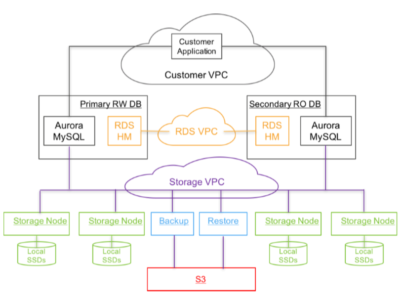
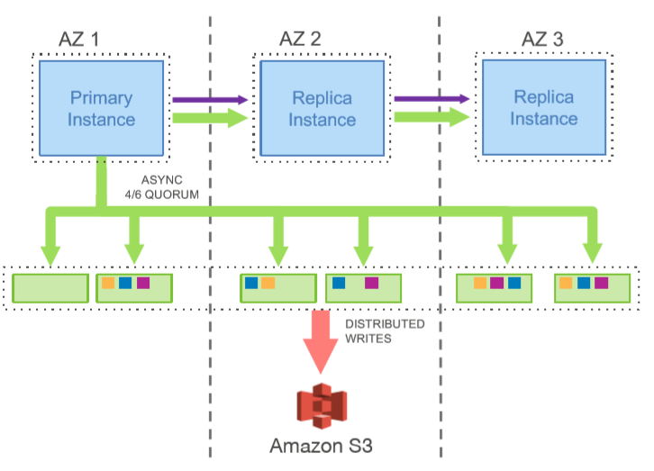
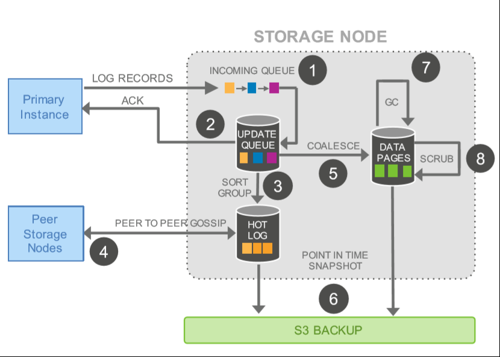

Amazon Aurora: Design Considerations for High Throughput Cloud-Native Relational Databases

## key ideas

> The big idea was to move away from the monolithic architecture of traditional databases and decouple storage from
compute. In particular, we moved the lower quarter of the database kernel to an independent scalable and distributed service that managed logging and storage. With all I/Os written over the network, our fundamental constraint is now the network.

> We use a novel service-oriented architecture with a multi-tenant scale-out storage service that abstracts a virtualized segmented redo log and is loosely coupled to a fleet of database instances. Although each instance still includes most of the components of a traditional kernel (query processor, transactions, locking, buffer cache, access methods and undo management) several functions (redo logging, durable storage, crash recovery, and backup/restore) are off-loaded to the storage service.

To reduce MTTR (Mean Time to Repair), the database is partitioned, in case of failure, each partition can be required quickly:

> We do so by partitioning the database volume into small fixed size segments, currently 10GB in size. These are each replicated 6 ways into Protection Groups (PGs) so that each PG consists of six 10GB segments, organized across three AZs, with two segments in each AZ.

The redo processing is offloaded to storage service:

> In Aurora, the only writes that cross the network are redo log records. No pages are ever written from the database tier, not for background writes, not for checkpointing, and not for cache eviction. Instead, the log applicator is pushed to the storage tier where it can be used to generate database pages in background or on demand. Of course, generating each page from the complete chain of its modifications from the beginning of time is prohibitively expensive. We therefore continually materialize database pages in the background to avoid regenerating them from scratch on demand every time. Note that background materialization is entirely optional from the perspective of correctness: as far as the engine is concerned, the log is the database, and any pages that the storage system materializes are simply a cache of log applications. Note also that, unlike checkpointing, only pages with a long chain of modifications need to be rematerialized. Checkpointing is governed by the length of the entire redo log chain. Aurora page materialization is governed by the length of the chain for a given page.

Activities on the storage node in more details:

> (1) eceive log record and add to an in-memory queue, (2) persist record on disk and acknowledge, (3) organize records and identify gaps in the log since some batches may be lost, (4) gossip with peers to fill in gaps, (5) coalesce log records into new data pages, (6) periodically stage log and new pages to S3, (7) periodically garbage collect old versions, and finally (8) periodically validate CRC codes on pages.

Gossip is used for storage nodes to get in sync:

> we maintain points of consistency and durability, and continually advance these points as we receive
acknowledgements for outstanding storage requests. Since any individual storage node might have missed one or more log
records, they gossip with the other members of their PG, looking for gaps and fill in the holes.

Replicas:

> In Aurora, a single writer and up to 15 read replicas can all mount a single shared storage volume.

## Note

The paper discribe how Aurora evicts pages when the buffer cache is full (in section 4.2.3) which I do't quite understand:

> While the Aurora database does not write out pages on eviction (or anywhere else), it enforces a similar guarantee: a page in the buffer cache must always be of the latest version. The guarantee is implemented by evicting a page from the cache only if its “page LSN” (identifying the log record associated with the latest change to the page) is **greater than or equal** to the VDL. This protocol ensures that: (a) all changes in the page have been hardened in the log, and (b) on a cache miss, it is sufficient to request a version of the page as of the current VDL to get its latest durable version.

As we know, to avoid data corruption, to evict a dirty page from the buffer cache, we need to obey the WAL (write ahead logging) protocol: we can only flush a dirty page from the buffer cache after the correspoding logs that modify the page have been flushed. Here it mentions that it can evict a page if its "page LSN" is **greater than or equal** to the VDL. My understanding is that VDL marks the latest LSN that is made durable to the storage service, if the page LSN is **greater than or equal**, it means the corresponding log entries that modify the page have not been flushed yet, it cannot evict the page since this will violate the WAL protocol. I don't quite understand how this part works based on the paper.